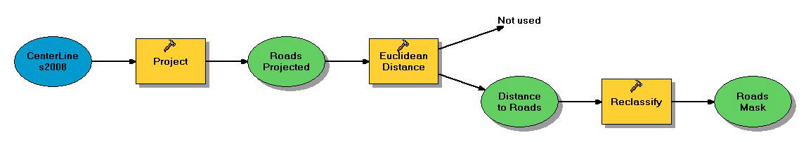
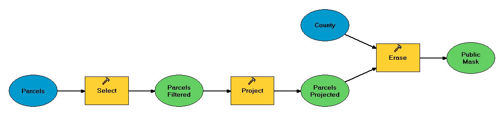

```{r setup, include=FALSE}
knitr::opts_chunk$set(echo = TRUE, message = FALSE, warning = FALSE)
```

```{r, include=FALSE}
library(sf)
library(raster)
library(tidyverse)
library(fasterize)
library(mapview)
library(rgdal)
```


```{r, include=FALSE}
base_rast = raster::raster('data/Wind2002.tif')
#plot(base_rast)

county_sf = sf::st_read('data/county.shp')

st_layers('data/Basemap.gdb')

cities_sf = sf::read_sf(dsn = 'data/Basemap.gdb', layer = 'Cities')

#roads_sf = sf::read_sf(dsn = 'data/Basemap.gdb', layer = 'CenterLines2008')

ca_alb = st_crs(county_sf) # can reuse this crs later now 
```


```{r, echo=FALSE}
ggplot()+
  theme_minimal()+
  geom_sf(data = county_sf, fill = 'grey30')+
  #geom_sf(data = roads_sf, color = 'darkred', size = 0.25)+
  geom_sf(data = cities_sf, fill = 'grey40', color = 'grey50')+
  geom_sf_text(data = cities_sf, aes(label = CITY), color = "white", size = 3)
```


```{r, echo=FALSE}
wind_raw_rast = raster('data/Wind2002.tif')
plot(wind_raw_rast, main = "Raw wind raster") #look at help for Reclassify 

rcl_mtx = matrix(data = c(c(1, 2, 3, 4, 5, 6, 7),
                          c(NA, NA, 1, 1, 1, 1, 1)), 
                 ncol = 2, byrow = FALSE) 
wind_mask_rast = reclassify(wind_raw_rast, rcl = rcl_mtx)
plot(wind_mask_rast)
```

### Casey's preferred way 
```{r}
wind_mask2 = wind_raw_rast

tmp = 1:50
tmp[10:15] #indexes the vector 
tmp[tmp>15 & tmp <40] = 10000 # this selects some and replaces it with a number 

values(wind_mask2)[values(wind_mask2) <= 2] = NA #Gives us 3-7, doesn't have to be ones and NAs
wind_mask2 = wind_mask2/wind_mask2

#writeRaster(wind_mask2, 'output/wind_mask.tif', overwrite = TRUE) 
```

### Create road mask 


Creating the Roads mask and giving it the option to skip over if the file already exists 
```{r}
road_mask_file = 'output/road_mask.shp'

if(file.exists(road_mask_file) ==FALSE) { #this if statement allows us to skip this step if this exists already 
  roads_raw_sf = sf::read_sf(dsn = 'data/HW3.gdb',
                         layer = 'CenterLines2008')


#st_layers('data/HW3.gdb')
roads_raw_sf = sf::read_sf(dsn = 'data/HW3.gdb',
                       layer = "CenterLines2008")
#st_crs(roads_raw_sf) #wrong projection and is in feet

roads_projected_sf = st_transform(roads_raw_sf, ca_alb) 

roads_mask_sf = roads_projected_sf %>% 
  st_buffer(dist = 7500) %>% #creates buffer around the roads
  st_union() %>% #stacks everything makes it simpler 
  st_intersection((county_sf)) #clips to county
write_sf(roads_mask_sf, road_mask_file)
} #end of test 

roads_mask_sf = read_sf(road_mask_file)
plot(roads_mask_sf)#select the first variable

```


```{r}
roads_mask_rast = fasterize::fasterize(sf = roads_mask_sf, 
                                       raster = base_rast) #will convert an sf to a raster that we want it to look like 
plot(roads_mask_rast)
#writeRaster(roads_mask_rast, 'output/road_mask.tif', overwrite=TRUE)
```

Quick check to compare the rasters 
```{r}
source('helper_fxns.R')
roads_key = raster('hw3_arc_outputs/road_mask.tif')
#plot_diffs(roads_key, roads_mask_rast) #Can see around the edges there are differences between the two different methods 
```

### Urban Mask: Skipping other masks for now, see the other code for the Urban mask 

### Create public mask

```{r}
public_mask_file = 'output/public_mask.gpkg' #geopackage, one file instead of four-eight

#if(!file.exists(public_mask_file))

{
parcels_sf = read_sf(dsn = 'data/HW3.gdb', layer = 'Parcels')
parcels_public = parcels_sf %>% 
  st_transform(ca_alb) %>% 
  filter(USECODE >= '6000' & USECODE < '9000') %>% #using text feidl not number field
  st_union() #flatten into one thing

public_mask_sf = st_difference(county_sf,
                               parcels_public)
#mapview(public_mask_sf)
write_sf(public_mask_sf, public_mask_file)
}
public_mask_sf = read_sf(public_mask_file)


public_mask_rast = fasterize(public_mask_sf, base_rast)

```

###Quick analysis 
```{r}
suitable_mask = wind_mask_rast %>% 
  raster::mask(roads_mask_sf) %>% 
  mask(public_mask_rast)

mapview(suitable_mask)

mask_stack = raster::stack(wind_mask_rast,
                           roads_mask_rast,
                           public_mask_rast)
plot(mask_stack)

suitable_stack = mask_stack %>% 
  raster::calc(fun = prod) #want NA to screw it up

plot(suitable_stack)

suitable_sum = mask_stack %>% 
  calc(fun=sum, na.rm=TRUE)
plot(suitable_sum)
```


