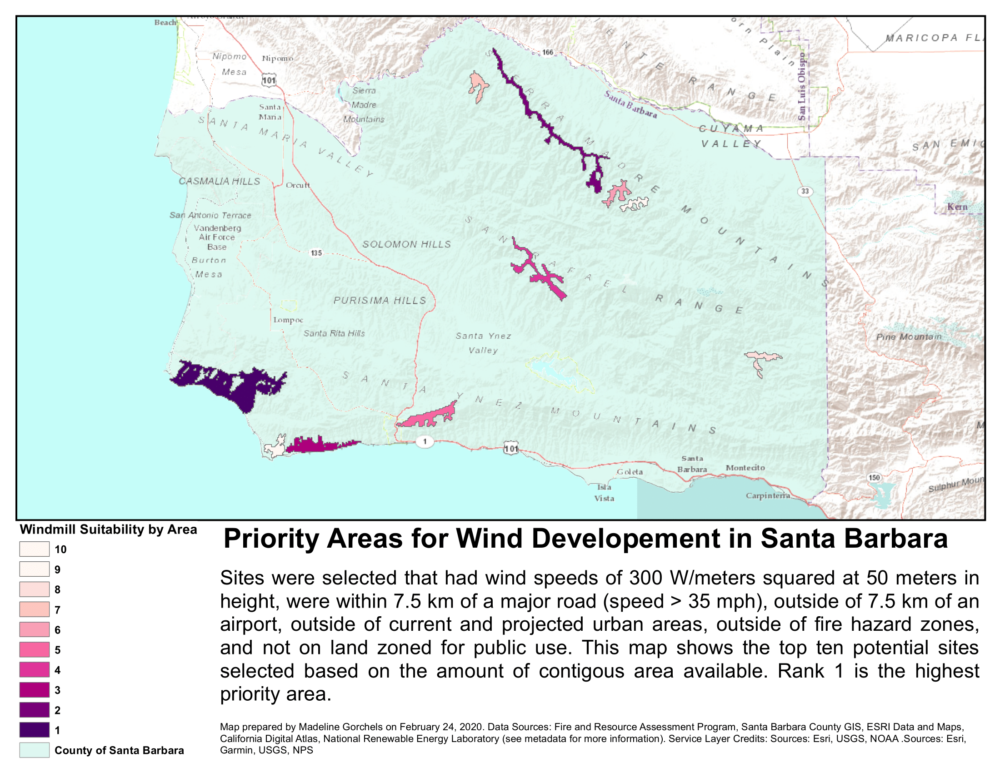

Wind power is an essential tool to reduce greenhouse gas emissions. However, installing wind projects poses challenges from permitting to NIMBY-ism. As part of a spatial analysis and environmental management course, I developed an ArcMap tool that takes information on roads, cities, airports, potential for fires, and land use to generate optimal sites for wind development. The following map shows an example of this tool being used for Santa Barbara County. The areas shown below are the 10 largest contiguous areas that met all criteria, though many more sites were found. 

